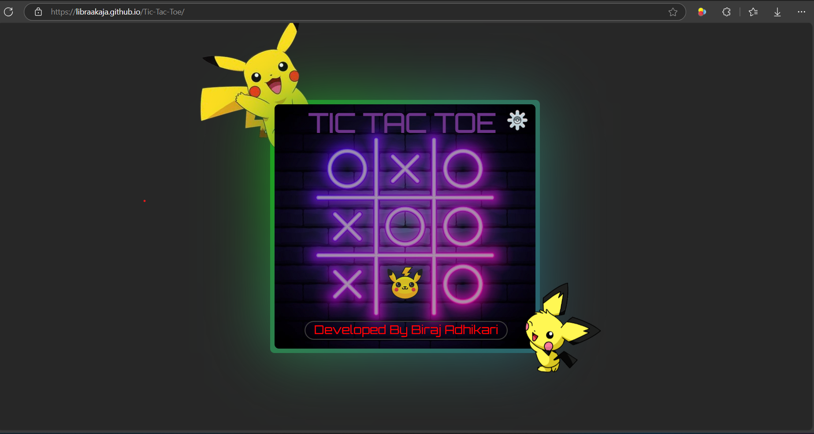

# Tic Tac Toe Game

This project was created using **HTML**, **CSS**, and **JavaScript**.
It demonstrates basics of web development with a user friendly interface.

## 🌟 Features

- **Multi-page Layout**: Includes structured pages for a complete user experience.
- **Custom Styling**: Designed with CSS for an attractive user interface.
- **Interactive Elements**: Functional JavaScript adds interactivity.
- Responsive on Desktop devices.

## 🗃️ Folder Structure

Tic-Tac-Toe/ <br>
├── assets/       # Contains images and sounds for game<br>
├── css/          # Contains all css files<br>
├── pages/        # Contains all html files<br>
├── scripts/      # Contains all js files<br>
├── index.html <br>
├── README.md  <br>

## 🌐 Live Demo
[Play Now](https://LibraAkaja.github.io/Tic-Tac-Toe/) 🎲

## 📦 How to Run

1. Clone this repository:
   ```bash
   git clone https://github.com/LibraAkaja/Tic-Tac-Toe.git

2. Navigate to the project folder
   ```bash
   cd Tic-Tac-Toe

3. Open the index.html file in your browser.

## Technologies Used

- HTML
- CSS
- JavaScript

## Screenshots


## Acknowledgements
- Icons (play, settings, cross, circle) by [Icon Finder](https://www.iconfinder.com/)
- Sounds by [Pokémon Go],[Pokémon Anime], [Pixabay](https://pixabay.com/)
- The following images used in this project were sourced form the internet:
	[pichu],[pikachu], [TTT], [Lpg] from Bing image search
- Styling tutorial by Kevin Powell (https://youtu.be/-VOUK-xFAyk?si=BkuZDc-oZAB_OxMh)

## 🤝 Contributing
This project is currently **not open for contributions**. If you have any suggestions or feedback, feel free to open an issue.

## 🚫 License
This project is for personal or educational use only. Redistribution or commercial use is not allowed.

## 📞 Contact
For any inquiries or feedback, feel free to reach out:  
- 📧 **Email:** [adhikaribiraj908@gmail.com](mailto:adhikaribiraj908@gmail.com)  
- 🔗 **GitHub Issues:** [Report a Bug or Suggest a Feature](https://github.com/LibraAkaja/Tic-Tac-Toe/issues)  
